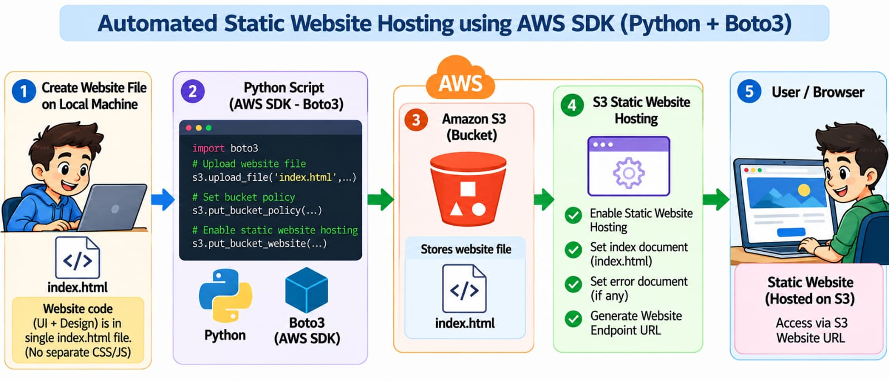
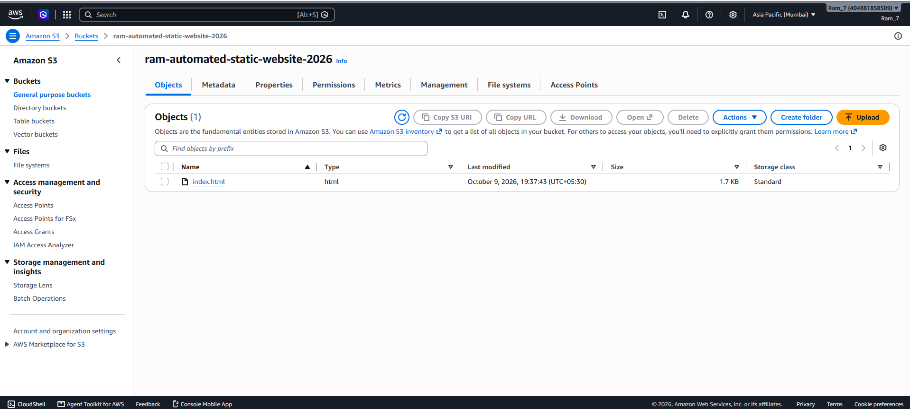
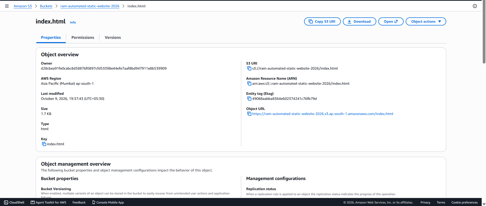
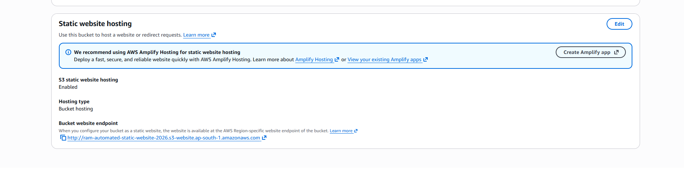
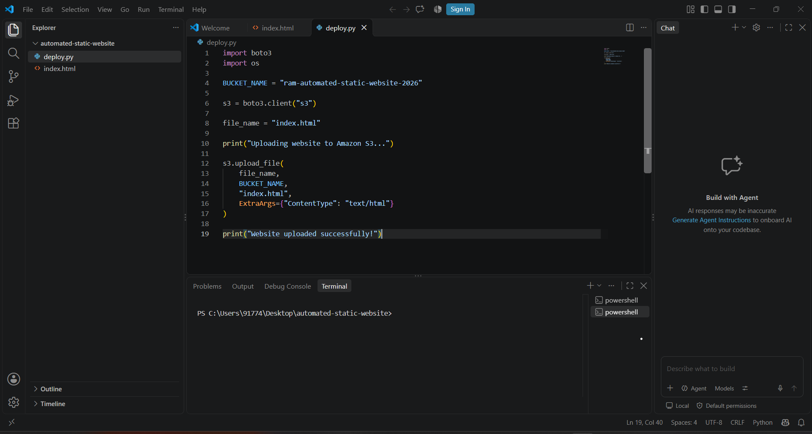
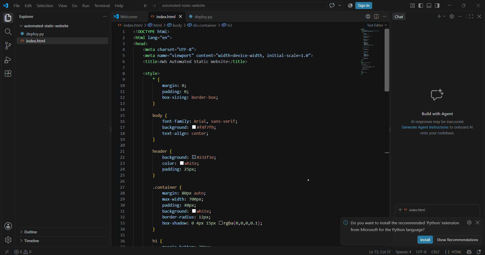
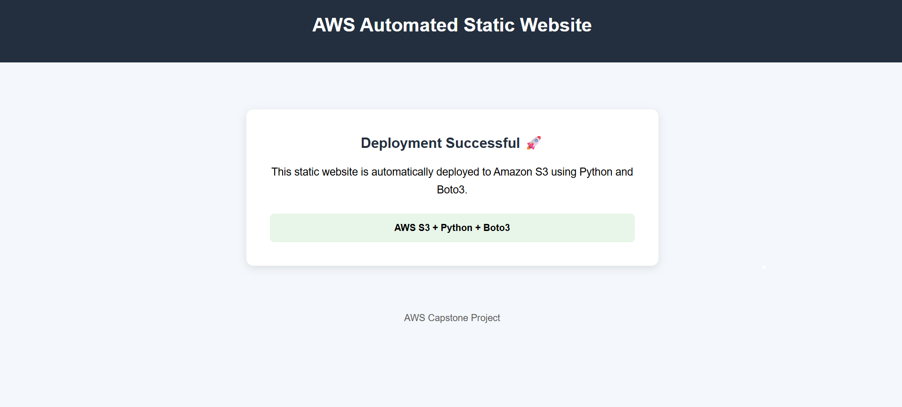

# 🌐 Automated Static Website Hosting Using AWS SDK

## 📌 Project Overview

This project demonstrates how to automatically deploy a static website to Amazon S3 using **Python, Boto3, and the AWS SDK**.

Instead of manually uploading website files through the AWS Console, a Python script is used to interact with Amazon S3 and automate the deployment process.

The website is hosted using **Amazon S3 Static Website Hosting** and can be accessed through the generated S3 website endpoint.

---

## 🎯 Objective

The main objectives of this project are:

- Create or identify an Amazon S3 bucket.
- Upload the static website using Python and Boto3.
- Upload files with the correct content type.
- Configure Amazon S3 for static website hosting.
- Make the website accessible through an S3 website endpoint.
- Automate website deployment using the AWS SDK.

---

## 🛠️ Technologies Used

| Technology | Purpose |
|---|---|
| Amazon S3 | Stores and hosts the static website |
| Python | Used to create the deployment script |
| Boto3 | AWS SDK for Python |
| HTML | Used to build the static website |
| AWS SDK | Allows Python to communicate with AWS services |

---

## 🏗️ Architecture

The project follows this workflow:

**Local Website → Python + Boto3 → Amazon S3 → Static Website Hosting → User Browser**

### Architecture Diagram

---

## ⚙️ How It Works

1. The static website is created using an `index.html` file.
2. A Python script uses the Boto3 AWS SDK to communicate with Amazon S3.
3. The script identifies or creates the required S3 bucket.
4. The website file is uploaded to the S3 bucket.
5. The appropriate content type is configured for the uploaded file.
6. Static website hosting is enabled on the S3 bucket.
7. The S3 website endpoint is generated.
8. Users can access the deployed website through their browser.

---

## 🪣 Amazon S3 Bucket

The S3 bucket used for this project is:

`ram-automated-static-website-2026`

The bucket stores the website files and provides static website hosting.

### S3 Bucket

---

## 📂 Website Files in S3

The website files are uploaded to the S3 bucket using Python and Boto3.

---

## 🌐 Static Website Hosting

Amazon S3 Static Website Hosting is enabled to make the website accessible through a public website endpoint.

---

## 🐍 Python + Boto3 Automation

Python and Boto3 are used to automate interaction with Amazon S3 instead of manually uploading the website through the AWS Console.

---

## 📄 Website Source

The static website is created using an `index.html` file.

The website design is contained within the HTML file, so separate CSS or JavaScript files are not required for this implementation.

---

## ✅ Running Website

After deployment, the website can be accessed using the Amazon S3 Static Website Endpoint.

---

## 🔐 Security

AWS credentials are not stored inside the source code or uploaded to GitHub.

AWS permissions should only allow the actions required to manage the S3 website.

For production environments, IAM permissions should follow the **principle of least privilege**.

---

## ❗ Failure Handling

Possible deployment issues include:

- S3 bucket not found.
- Incorrect AWS permissions.
- Website file not uploaded successfully.
- Static website hosting not enabled.
- Public access or bucket policy configuration issues.
- Incorrect content type.

Errors from Boto3 can be used to identify and troubleshoot deployment problems.

---

## 🚀 Production Improvements

This project can be improved in a production environment by:

- Using CloudFront for faster content delivery.
- Enabling HTTPS using CloudFront and AWS Certificate Manager.
- Using a custom domain with Amazon Route 53.
- Applying more restrictive IAM permissions.
- Adding automatic deployment through a CI/CD pipeline.
- Supporting automatic deployment of complete website folders.

---

## 📊 Project Result

The static website was successfully deployed to Amazon S3 using **Python and Boto3**.

The deployment demonstrates how AWS SDK automation can replace manual file uploads and configure a static website that can be accessed through an S3 website endpoint.

---

## 📸 Project Evidence

The repository contains screenshots showing:

- Amazon S3 bucket
- Uploaded S3 objects
- Static website hosting configuration
- Python/Boto3 deployment
- HTML source
- Running static website
- Architecture diagram

---

## 💡 Why These AWS Services Were Selected

**Amazon S3** was selected because it provides simple and cost-effective hosting for static websites.

**Python and Boto3** were selected to automate AWS operations programmatically instead of performing every deployment step manually through the AWS Console.

---

## 🔄 Service Communication

The Python application uses **Boto3 (AWS SDK)** to communicate with Amazon S3.

The website files are uploaded to the S3 bucket, S3 Static Website Hosting serves the content, and users access the website through the generated website endpoint.

---

## 📚 Key Learning

This project provided hands-on experience with:

- Amazon S3
- AWS SDK
- Python
- Boto3
- Static Website Hosting
- AWS automation
- Basic AWS security practices
